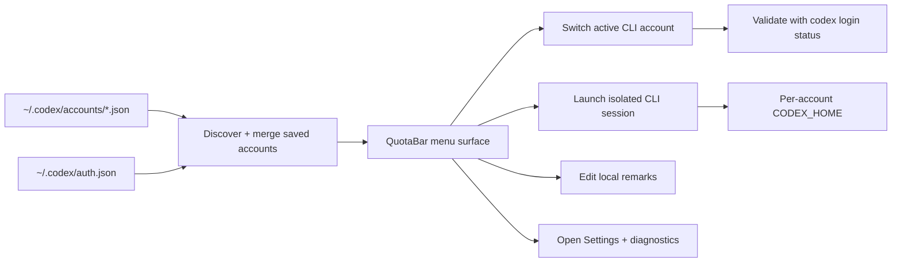

<p align="center">
  
</p>

<h1 align="center">QuotaBar</h1>

<p align="center">
  <strong>A polished macOS menu bar command center for Codex CLI accounts, quota windows, and provider diagnostics.</strong><br>
  Built from the <code>codextoken</code> repo slug, now presented as a cleaner outward-facing product brand.
</p>

<p align="center">
  <a href="#install"></a>
  <a href="#highlights"></a>
  <a href="#supported-languages"></a>
  <a href="README_CN.md"></a>
</p>

<p align="center">
  
  
  
  
  
</p>

---

## What QuotaBar Is

QuotaBar turns a fragile Codex CLI multi-account workflow into a polished menu bar experience.

Instead of hand-editing `~/.codex/auth.json`, guessing which account is active, and discovering too late that you used the wrong quota window, you get a dedicated control surface for:

- switching Codex accounts with validation and rollback
- viewing 5-hour and weekly quota windows at a glance
- saving and restoring local account snapshots
- launching isolated CLI sessions per account
- attaching local remarks so every saved account stays recognizable
- checking Claude and Antigravity local diagnostics from one place

---

## Highlights

- **Safe account switching**: swaps the active CLI account, validates the result, and rolls back if the target session is unusable.
- **Designed for real multi-account use**: saved snapshots, duplicate detection, hidden one-off sessions, local sort order, and editable remarks are all built in.
- **Fast menu bar workflow**: open the panel, compare accounts, switch, and keep working without opening config files.
- **Settings that matter**: language, startup tab, auto refresh, provider diagnostics, account management, local storage shortcuts, and advanced quota command controls.
- **Right-click shortcuts**: refresh, settings, re-login, open CLI, and switch accounts directly from the menu bar icon.
- **Local-first by default**: account state lives on your Mac, not behind a hosted backend.

---

## Supported Languages

QuotaBar now ships with these built-in interface languages:

- English
- 简体中文
- 繁體中文
- 日本語
- 한국어
- Español
- Português (Brasil)

`Follow System` is also supported, so the app can match your macOS language automatically when a bundled language pack exists.

---

## Why It Exists

Codex CLI is excellent at execution, but account management is still too manual if you operate across personal, work, client, backup, or test identities.

QuotaBar gives that workflow a proper surface:

| Need | What QuotaBar does |
| :--- | :--- |
| Stop editing `auth.json` by hand | Switch the live CLI account from the menu bar |
| Avoid burning the wrong quota | Show the active 5-hour and weekly windows before you launch work |
| Keep accounts understandable | Save local remarks and show them in the hero card, switcher, and right-click menu |
| Work across isolated sessions | Launch each account in its own Terminal with its own `CODEX_HOME` |
| Recover from stale sessions | Re-login or import the current session snapshot with one click |
| Debug provider state quickly | Surface local Claude and Antigravity diagnostics in Settings |

---

## Install

> Requirements: macOS 14+, Xcode, and [XcodeGen](https://github.com/yonaskolb/XcodeGen)

```bash
brew install xcodegen
git clone https://github.com/Zhao73/codextoken.git
cd codextoken
xcodegen generate
open CodexToken.xcodeproj
```

Then press `⌘R`. The app runs as a menu bar utility without a Dock icon.

### Run tests

```bash
xcodebuild test \
  -project CodexToken.xcodeproj \
  -scheme CodexTokenCore \
  -destination 'platform=macOS'
```

---

## Workflow



---

## Project Structure

| Layer | Responsibility |
| :--- | :--- |
| `CodexTokenCore` | Account discovery, metadata persistence, snapshot import/removal, CLI switching, quota providers |
| `CodexTokenApp` | SwiftUI menu bar UI, settings window, local caches, remarks, Terminal launch flows |
| Local files | `auth.json`, `accounts/*.json`, metadata JSON, copied config for isolated sessions |

### Design choices

- **Atomic switching** keeps failed account swaps from corrupting the active CLI session.
- **Bundle-based localization** keeps the app lightweight and dependency-free.
- **Provider snapshots + local fallback** make quota panels useful even when upstream data is partial.
- **Outward-only rebrand** keeps the stable repo slug and internal target structure while making the product presentation cleaner.

---

## Privacy

QuotaBar is local-first.

- No telemetry
- No analytics
- No cloud account sync
- No token relay service
- No third-party runtime dependencies

See [PRIVACY.md](PRIVACY.md), [SECURITY.md](SECURITY.md), and [CONTRIBUTING.md](CONTRIBUTING.md) for more details.

---

<p align="center">
  <strong>QuotaBar</strong> by Zhao73<br>
  If it improves your Codex workflow, consider starring the repo.
</p>
