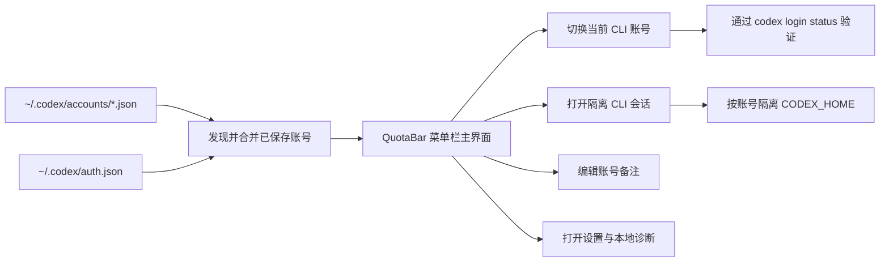

<p align="center">
  
</p>

<h1 align="center">QuotaBar</h1>

<p align="center">
  <strong>一个更精致的 macOS 菜单栏控制中心，用来管理 Codex CLI 账号、额度窗口和 Provider 诊断。</strong><br>
  仓库地址继续保留 <code>codextoken</code>，但产品对外名称升级为更清晰的 <code>QuotaBar</code>。
</p>

<p align="center">
  <a href="#安装"></a>
  <a href="#亮点"></a>
  <a href="#已支持语言"></a>
  <a href="README.md"></a>
</p>

<p align="center">
  
  
  
  
  
</p>

---

## QuotaBar 是什么

QuotaBar 把原本很脆弱的 Codex CLI 多账号工作流，变成了一个真正可用的菜单栏体验。

你不需要再手改 `~/.codex/auth.json`，也不用靠记忆猜当前激活的是哪个账号，更不用等额度扣掉了才发现自己切错号。现在你可以直接在菜单栏里完成：

- 切换 Codex 账号，并做真实验证与失败回滚
- 直接查看 5 小时和每周额度窗口
- 保存与恢复本地账号快照
- 为不同账号打开隔离的 CLI 会话
- 给账号写本地备注，避免列表越来越乱
- 在设置里查看 Claude / Antigravity 的本地诊断状态

---

## 亮点

- **安全切号**：切换当前 CLI 账号后会做验证，失败就自动回滚。
- **真正面向多账号**：支持快照、重复账号去重、隐藏一次性会话、本地排序、备注管理。
- **菜单栏效率高**：打开就能看，比较就能切，不需要再去翻配置文件。
- **设置更实用**：语言、启动页、自动刷新、Provider 诊断、账号管理、本地文件入口、高级命令都集中在一个设置面板里。
- **右键快捷操作**：刷新、设置、重新登录、打开 CLI、切换账号，都能从状态栏右键菜单直接完成。
- **默认完全本地**：核心账号数据都在你的 Mac 上，不依赖托管后端。

---

## 已支持语言

QuotaBar 现在内置以下界面语言：

- English
- 简体中文
- 繁體中文
- 日本語
- 한국어
- Español
- Português (Brasil)

同时支持 `跟随系统`，只要你的 macOS 语言命中内置语言包，界面就会自动切换。

---

## 为什么做它

Codex CLI 在执行任务上已经很好用了，但如果你同时维护个人号、工作号、客户号、备用号、测试号，多账号管理还是太手工。

QuotaBar 主要就是把这件事做成一个顺手的工具：

| 需求 | QuotaBar 怎么解决 |
| :--- | :--- |
| 不想再手改 `auth.json` | 直接从菜单栏切换当前 CLI 账号 |
| 不想用错额度 | 开工前先看当前 5 小时 / 每周额度窗口 |
| 账号太多认不出来 | 给账号加本地备注，并在主卡、切换面板、右键菜单一起显示 |
| 想隔离不同会话 | 每个账号都能单独启动自己的 `CODEX_HOME` |
| 会话过期后想快速恢复 | 一键重新登录或导入当前会话快照 |
| 想快速判断 Provider 状态 | 在设置里看本地 Claude / Antigravity 诊断 |

---

## 安装

> 环境要求：macOS 14+、Xcode、[XcodeGen](https://github.com/yonaskolb/XcodeGen)

```bash
brew install xcodegen
git clone https://github.com/Zhao73/codextoken.git
cd codextoken
xcodegen generate
open CodexToken.xcodeproj
```

然后按 `⌘R`。应用会以菜单栏工具的形式运行，不占 Dock。

### 运行测试

```bash
xcodebuild test \
  -project CodexToken.xcodeproj \
  -scheme CodexTokenCore \
  -destination 'platform=macOS'
```

---

## 工作流



---

## 项目结构

| 层 | 责任 |
| :--- | :--- |
| `CodexTokenCore` | 账号发现、元数据持久化、快照导入/删除、CLI 切换、额度 Provider |
| `CodexTokenApp` | SwiftUI 菜单栏 UI、设置窗口、本地缓存、备注、Terminal 启动流程 |
| 本地文件 | `auth.json`、`accounts/*.json`、元数据 JSON、隔离会话配置 |

### 设计取向

- **原子切换**：失败的账号切换不会污染当前 CLI 登录态。
- **Bundle 本地化**：语言包简单直接，没有额外依赖。
- **Provider 快照 + 本地兜底**：上游数据不完整时，额度面板也不会完全失能。
- **只改对外品牌**：保留稳定的仓库 slug 和内部 target 结构，同时把产品名称升级得更清晰。

---

## 隐私

QuotaBar 是本地优先的。

- 不做遥测
- 不做分析上报
- 不做云端账号同步
- 不做 token 中转
- 不引入第三方运行时依赖

更多说明见 [PRIVACY.md](PRIVACY.md)、[SECURITY.md](SECURITY.md)、[CONTRIBUTING.md](CONTRIBUTING.md)。

---

<p align="center">
  <strong>QuotaBar</strong> by Zhao73<br>
  如果它让你的 Codex 工作流更顺手，欢迎给仓库点个 Star。
</p>
